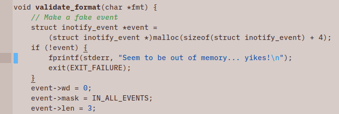
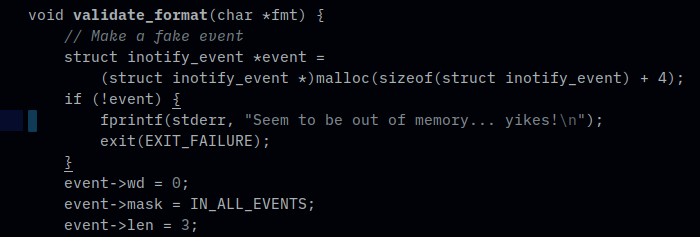

# Freedom Colour Schemes

Freedom is a collection of four minimal and functional colour schemes for Sublime Text.

* See your code as a continuous textual story without navigating colour changes
* Gentle on the eye whilst still providing contrast
* Comments stand out
* Strings, escape codes and constants are subtly defined to highlight errors
* Diffs and build output also considered

Dark and Light variants follow a traditional grey tone path based on the Material Design colour system.

Earth and Interstellar take a more humanised form.

Earth is soft and lush. It's light whilst avoiding the harshness of grey tones. Gentle and kind and out of your way.

Interstellar is for serious work in the dark. Sensitively deep and dimmed for low light conditions. Sparse to avoid distractions. Enter the void and become one with your code.

Also available for [Vim](https://github.com/frithrah/freedom-vim).
